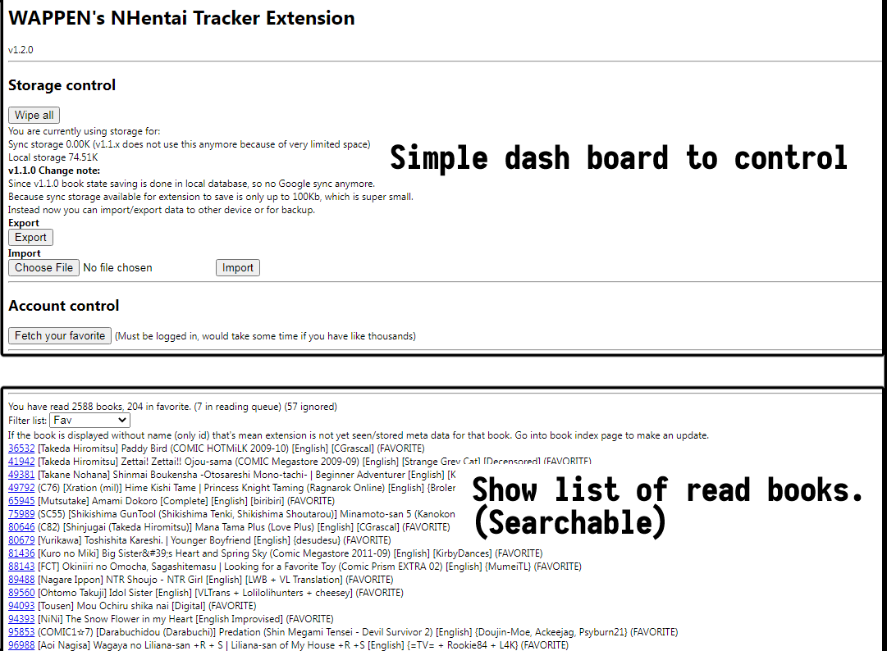

# WAPPEN's NHentai Tracker Extension (Now v1.2.0)
A Chrome extension to help you keep track of read book number.
Display badge over all book covers. Never got lost in search result again!

### Features
- Mark book as READ or IGNORED and display them over search result to quickly skim for new book to read.
- Also auto mark as READ when you go into any of its page to read.
- Mark as read later for reading list.
- See  for change list.

### Chrome
 Chrome Store: **Sorry none yet!** It needs to pass some ~~fapping~~ err I mean QA testing first.

### Firefox
I'm never intended to port to FF yet. Sooooorry! (CHECKMATE FF users!)

------

### Installing
- As this is not published to store, the only way to install is via developer mode.
- Download this entire repo, top right of this web page 'Code' button -> download zip (.zip) 
- Unzip it to some folder, but dont unzip your pants yet, still some more steps to go.
- Go into Chrome extension tab, enable developer mode (upper right).
- Select load unpacked extension (upper left).
- Point the to folder where you unzip it, where "manifest.json" is. (manifest.json wont show on dialog, that's ok, just select the folder)
- Extension is installed as "NHentai Tracker". 
- If you want more help regarding above steps, search for something like **Chrome install unpacked extension**.
- Unzip your pants, go to NHentai.
- What you can do next:
  - Open extension option page by clicking extension badge. Import your favorite list. (Must be logged in)
  - (Advanced) Export past browsing history and import to extension to scan for past visit. Read more below.

### Pulling past visit from history
Extension can do it in 2 ways, none of them are automated, so you need some work.
- Google takeout (not much detailed history though, I pulled only a few out of it), to start, google something like "google export browsing history".
- Or you export current Chrome history (note that [chrome will only hold up to 3 months of history locally](https://superuser.com/questions/364470/), which is stupid if you ask me)
- I used this extension, [History Trends Unlimited](https://chrome.google.com/webstore/detail/history-trends-unlimited/pnmchffiealhkdloeffcdnbgdnedheme) which crunch history and further saving it longer than 3 months limit. 
Anyway, if you just installed this Unlimited extension, you still have no way to bring back your history beyond that 3 months anyway.
- If you have history exported from **History Trends Unlimited**, scan it in NHTracker's setting page in the second file submit section.

### Upgrading
- Upgrading from previous version, just redownload this again and unzip to same location.
- In your chrome extension page, click the circle arrow (reload extension) and you are done. Notice the version number should changed.
- If you have any NH tab already open you need to refresh them once for the new version to take effect.

------

### Q&A
**Why there are 'READ' and 'IGNORED' book state? What's the difference?**
- The 'IGNORED' state is used to mark book as **"Checked that out but passed"** rather than **"I read that! (to the end!)"**. 
- Example usage is using IGNORE tag on the book you totally not interested in. 
- Or another usage is to mark them on another sibling books. (incompleted, reuploaded, low quality, bad translation, etc)
- Ignored book will not show in read book listing.
- Ignored bool will colored differently in search result.
  
**I want XX YY ZZ feature! Make it!! plzzzz**
- If it sounds good, pitch it to me via issue page.
- Else you have to learn HTML+JavaScript and do it yourself. :P

**What is it inspired from?**
- I noticed that browser always mark visited link, like from blue to purple for an eon since internet started, but now in 2022 I have trouble looking at doujin search result, how comes?
- So I searched chrome extension store and github for something like this, hoping that some gentleman would already made it.
- But I found stuff like extension that let you highlight NH number and jump to the site (to save some steps and typing), or the other that when you highlight NH number it will popup and preview the doujin (in fear of stepping into degenerated doujin). 
- I was like WTF this is the best you people can think of??? What The Heck??? Why do you people so serious about those little number?? Just copy paste it and go to the site to check it out like a man!!
- Ok I'm done ranting, that was how this extension was born.

**Problems, HALP!**
- Report it in Github issue. Thank you!
- Or fix it yourself if you are a wizkid.

### Credit
- To great myself.
- Took code skeleton from https://github.com/Xwilarg/NHentaiAnalytics thanks!
- Stackoverflow for making me able to go through JavaScript hell after not writing it for 5 years. At least it is better than Java shit.
